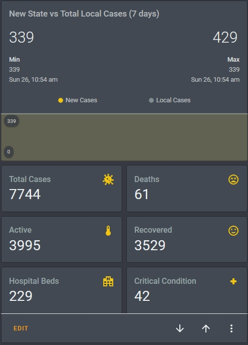
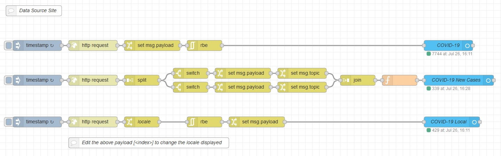

# Victoria (AUS) COVID-19 Home Assistant Stats

This is a Node-RED flow and example card to pull the latest Australia/Victoria COVID-19 stats from open datasets. It contains both Victoria-wide and locale-based datasets.

 
 > Note that the graph card only displays a chart starting from the date you add the flow to your HA system.

## Dependencies

- [HACS](https://hacs.xyz/docs/installation/manual)
- Node-RED (both [standard integration](https://community.home-assistant.io/t/home-assistant-community-add-on-node-red/55023) and HACS Node-RED [custom entity integration](https://github.com/zachowj/hass-node-red))

## Setup

1. Open Node-RED inside Home Assistant, select the menu icon in the top right, then click "Import".
2. Copy the code from the [flow.json](flow.json) file in this repository and paste it into the import text box.
3. Deploy! You should now have the Covid-19 entities if you search in the configuration menu's entity list.

## Select your locale

1. Open the [Victorian Covid feed json](https://interactive.guim.co.uk/covidfeeds/victoria.json) and find the ID of your locale.
2. Open up the flow in Node-RED, double click on the `locale` node and change the ID (default is Moreland, 45).
3. Deploy!

## Card example

(pictured at the top)  

To use my example card, you need the following custom cards from HACS:
 
 - mini-graph-card
 - horizontal-stack
 - vertical-stack
 
 Simple copy the code from the [card.yaml](card.yaml) file in this repository and paste it into a new manual entity.  
 
 
 ## Resources
 
 This project sources its Covid-19 data from the following sites updated daily:

 - https://github.com/covid-19-au/covid-19-au.github.io
 - https://interactive.guim.co.uk/covidfeeds/victoria.json
