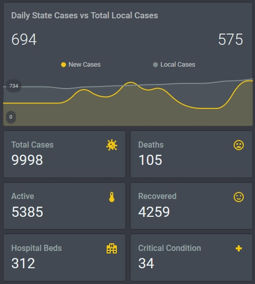

# Victoria (AUS) COVID-19 Home Assistant Stats

This is a Node-RED flow and example card to pull the latest Australia/Victoria COVID-19 stats from open datasets. It contains both Victoria-wide and locale-based datasets.

 ## UPDATED
 
 I've just updated the flow to add the Covid average in Victoria over 14 days to suit the current plan moving out of lockdown.
 If you're updating from a previous version, you'll need to update the flow with the new flow.json, and create a new manual card in lovelace, then copy in the covid_average.yaml code for the below card:
 

 
 > Note that the graph card only displays a chart starting from the date you add the flow to your HA system.  

## Dependencies

- [HACS](https://hacs.xyz/docs/installation/manual)
- Node-RED (both [standard integration](https://community.home-assistant.io/t/home-assistant-community-add-on-node-red/55023) and HACS Node-RED [custom entity integration](https://github.com/zachowj/hass-node-red))

## Setup

1. Open Node-RED inside Home Assistant, select the menu icon in the top right, then click "Import".
2. Copy the code from the [flow.json](flow.json) file in this repository and paste it into the import text box.
3. Deploy! You should now have the Covid-19 entities if you search in the configuration menu's entity list.

## Select your locale

### Firefox
1. Open the [Victorian Covid feed json](https://interactive.guim.co.uk/covidfeeds/victoria.json) and find the ID of your locale.
2. Open up the flow in Node-RED, double click on the `locale` node and change the ID (default is Moreland, 45).
3. Deploy!

### Non index displaying JSON readers

Firefox will automagically display the JSON file with an index of the locale that you can replace in the Node-RED flow as described above. Other browsers might not display the index. If that's the case, try this:

1. Go here: https://jsoneditoronline.org/
2. Click `Open` > `Open from URL` and paste the [Victorian Covid feed json](https://interactive.guim.co.uk/covidfeeds/victoria.json)
3. Click the `Copy >` button between the two panels and you should be able to search the list for your locale, that is listed under the index number of the locale that you can then enter using the steps above.

## Card example

(pictured at the top)  

To use my example card, you need the following custom cards from HACS:
 
 - mini-graph-card
 - vertical-stack
 
 Simply copy the code from either of the two card example yaml files and paste it into a new manual entity.:
  - [card.yaml](card.yaml) for a detailed card without the average.
  - [covid_average.yaml](covid_average.yaml) if you're only interested in the 2 week average.
 
 
 ## Resources
 
 This project sources its Covid-19 data from the following sites updated daily:

 - https://github.com/covid-19-au/covid-19-au.github.io
 - https://interactive.guim.co.uk/covidfeeds/victoria.json
